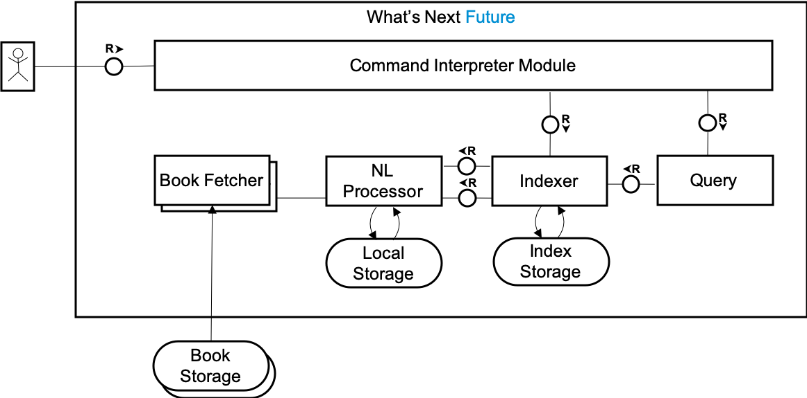

# What's Next

What's next in life? That's a hard question. You know, when people are asked something hard, sometimes they think of an easier analogy and give an answer to it instead.

What's is easier then? What is next in a bunch of books. Let's try to answer this instead.

## Project structure

This is a GoLang project utilizing the layout outside GOPATH. For more information check [these resources](https://github.com/golang-standards/project-layout).

*The diagram uses TAM notation. For more information check [this guide](http://www.fmc-modeling.org/fmc-and-tam).*

## Project state 

Under construction, however already buildable and executable. A working prototype in Python is available [here](https://github.com/whatsnextquestion/whats-next-python).